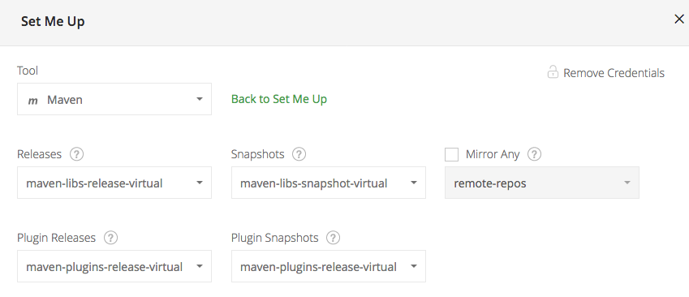

# Installation

The Aerie project uses Docker Compose to configure and run the entire
project. Docker Compose utilizes YAML configuration files which are
located in the root of the project. The YAML configs include everything
that is required to run Aerie with [Docker][docker] and [Docker Compose][compose].

> Compose is a tool for defining and running multi-container Docker
> applications. With Compose, you use a Compose file to configure your
> application’s services. Then, using a single command, you create and start
> all the services from your configuration.

In most cases, Docker Compose will pull down pre-built Docker
containers for each of the servers which make up the AMPSA application.
These containers are built at runtime, but will eventulally be retrieved
from our local JPL installation of DockerHub which is hosted on
[Artifactory][artifactory].

Once the necessary containers are pulled down, Docker Compose will orchestrate
the network of services and start them up.

## Important Note

This demo is NOT designed for production use or performance
testing. It has not been optimized in any way. It WILL be slow and should not be
considered for release. Per Tyk recommendations, a production configuration
would have each component on a separate machine, following the [docs][tyk],
however the actual configuration is TBD.

## Prerequisites

To start the services using Docker Compose you must have Git,
[Docker][docker], and [Docker Compose][compose] installed.

## Basic steps

The basic steps are:

1. Clone the repository using Git
2. Log in to Docker Hub
3. Create an Artifactory settings.xml file for local development
4. Configure services (if running the full configuration)
5. Start the services using the appropriate configuration file

## Authentication

Before the local and full configurations can be run, you will need to login to
Artifactory:

```
docker login -u $USERNAME cae-artifactory.jpl.nasa.gov:16001
```

Where `$USERNAME` is your LDAP username. You will be prompted to enter your
password. Once successful, you are logged in and can pull down MPSA images.

NOTE: Access is intended for MPSA Aerie Developers. If you have tried to login
and you get an access denied message, please contact seq.support@jpl.nasa.gov
to request access.

## Artifactory Settings.xml

You need an Artifactory settings.xml file with your JPL credentials so you can download and use Artifactory packages locally. Follow these steps to set this file up:

1. Go to https://cae-artifactory.jpl.nasa.gov/artifactory/webapp/#/artifacts/browse/tree/General/maven-libs-snapshot-local and log in with your JPL credentials
2. Click "Set Me Up"
3. Type in your JPL password
4. Use the settings shown below.

5. Click "Generate Maven Settings" and then "Generate Settings" which will download a `settings.xml` file
6. Move `settings.xml` into `~/.m2/`, replacing the old `settings.xml` if it exists.

## Configuration

The basic command that you will use to start services with Docker Compse is:

    docker-compose up

This would start the default configuration which is tailored toward local dev.
To start additional services, you will use a specific configuration like this:

    docker-compose [-f <docker-compose-ARG>.yml] up -d

The `<docker-compose-ARG>.yml` roughly corresponds to the environment
that you may require, as outlined below. The `-d` option will run the services
in the background. To get a feel for how the service works though, you can
omit it.

The services may take several minutes to start. Once the logging output from
`docker-compose` has slowed down, you should be able to access the services as
per their individual documentation.

Press `cmd+c` or `ctrl+c` to stop all services if docker-compose is running in
the foreground. Or to stop an application which has been started in the background,
run the following:

    docker-compose [-f <docker-compose-ARG>.yml] stop

Where the `<docker-compose-ARG>.yml` file corresponds to the environment
which you started the application with.

### docker-compose.yml

This configuration is intended for local development where you do not want
to actively develop the core services. This could be useful as a starting place
for local development where the developer may comment out sections that they
are working on. In this environment images are retrieved from Artifactory.

### docker-compose-full.yml

This is the the _entire_ stack, including logging, analytics, the full API
gateway dashboard, and all of the core services. This is intended for use in a
production environment, with a host that has a healthy amount of RAM, CPU,
and disk space. It _can_ be run locally, but may not provide great performance.

**Additional configuration required**

Analytics and Tyk Dashboard have additional configuration to make them work.
See the relevant sections below to get them set up properly.

## Analytics configuration

In the analytics directory there is a file called `analytics.env-example`.
This file needs to be renamed to `analytics.env`. This will eventually enable
the ability to create a custom database settings. For now, however, leave the
settings as is.

Once the service has been started, you will need to run the setup script in the
analytics directory.

    cd analytics
    ./setup.sh

This will initialize the database that will be used by Matomo.

## Tyk configuration

To start the Tyk stack you will first need to do some minor configuration.
Then you can use the `tyk` and `tyk_local` files. See step 3, below.

1. Set up your `/etc/hosts` file to include the IP of your docker daemon:

```
127.0.0.1 www.tyk-portal-test.com
127.0.0.1 www.tyk-test.com
```

Note that the IP may be different depending on your installation, Windows users
may find it running on `10.x.x.x`, it is important the URL stays the same
because our `setup.sh` assumes this is the one you are using.

2. Add your dashboard license

Open the `tyk_dashboard/tyk_dashboard.conf` file and add your license string
to the `"license_key": ""` section.

3. Start the full stack

```
docker-compose -f docker-compose-full.yml up
```

4. Bootstrap the instance (creates a test user):

```
cd ../tyk_dashboard
chmod +x setup.sh
./setup.sh
```

Make sure you save the passwords somewhere. Optionally, create a user with the
methods used in the `setup.sh` file.

5. Log in with the credentials provided.

The setup script will provide a username and password, as well as the URL of
your portal, please note that this will be running on port 3000, not port 80.

[artifactory]: https://cae-artifactory.jpl.nasa.gov
[tyk]: https://tyk.io/docs/.
