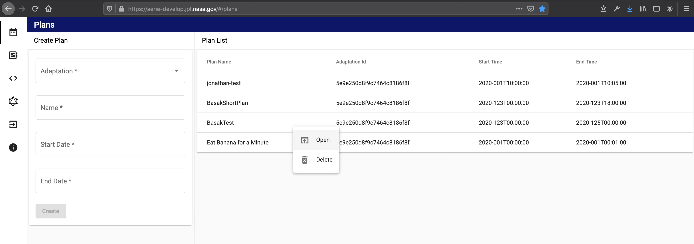
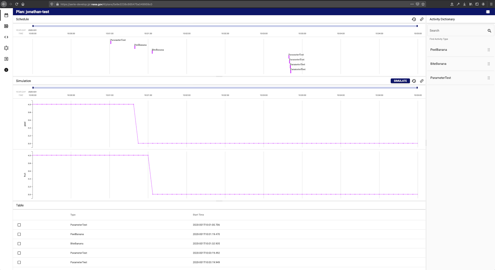

# Planning UI

The Aerie planning web application provides a graphical user interface to create, view, update and delete mission model and plans.

## Uploading Mission Models

Mission models can be uploaded to Aerie via the UI. To navigate to the [mission model page](https://aerie-staging.jpl.nasa.gov/models), click  the `Mission Models` icon on the on the left navigation bar. Once an [mission model JAR](https://github.com/NASA-AMMOS/aerie/wiki/Developing-a-Mission-Model) is prepared, it can be uploaded to the mission model service with a name, version, mission and owner. The name and version must match (in case and form) the name and version specified in the mission model.

For example, if the mission model is defined in code as
`@MissionModel(​​name=​"Banananation", v​ersion​="0.0.1")`, then the name field must be entered as `Banananation` and the version as `0.0.1`. Once the mission model is uploaded it will be listed in the table shown in Figure 1. Mission Models can be deleted from this table using the context menu by right clicking on the mission model.

*Figure 1: Upload mission model, and view existing mission model.*

## Creating Plans

To navigate to the [plans page](https://aerie-staging.jpl.nasa.gov/#/plans), click the `Plans` icon on the left navigation bar. Users can use the left panel to create new plans associated with any mission model. A `start` and `end` date has to be specified to create a plan.
Existing plans are listed in the table on the right. Use right click on the table to reveal a drop down menu to delete and view plans.

*Figure 2: Create plans, and view existing plans.*

Base simulation arguments may be supplied at plan creation time.
For more information please refer to [Aerie Simulation Configuration UI](https://github.com/NASA-AMMOS/aerie/wiki/Aerie-Simulation-Configuration-UI) documentation.

## View and Edit Plans

Once a user clicks on an existing plan, they can view contents, add/remove activity instances, and edit activity instance parameters. The plan view is split into the following default panels:

* Schedule Visualization
* Simulation Visualization
* Activity Instances Table
* Side drawer containing:
  * Activity Dictionary
  * Activity Instance Details

In the default side drawer the activity dictionary is displayed. Once a type or instance is selected, users can view details such as metadata and parameters by moving the arrow keys down. Activities can be dragged into the timeline from the activity dictionary. Once instances are added they will appear in the Activity Instances table panel.

*Figure 3: Default panels.*

When a user clicks on an activity instance in the plan, the form to update activity parameters and start time will appear on the right drawer as shown in Figure 4. Users can use this form view to remove instances from the plan.

*Figure 4: When an activity instance in plan is selected, its details will appear in the right drawer.*

In the schedule and simulation elements, violations are shown as red regions in their respective bands as well as the corresponding time axis.

*Figure 4.1: When violations occur, they will be represented as red areas on the timeline, with an accompanying hover state.*

Horizontal guides may be added to any simulation or activity schedule band. The horizontal guides control UI may be accessed through each band's three dots more menu.

*Figure 4.2: Horizontal guides may be added to each activity schedule or simulation bands

Aerie UI provides a flexible arrangement where users can hide any of these panels by simply dragging dividers vertically. In Figure 5 this feature of the UI is illustrated.

*Figure 5: The bottom panels are dragged to the top edge completely leaving only one panels in view.*

Note that all the default panels outlined here can be configured and changed based on the needs of a mission. You can read about how to do that in the [UI Configurability](https://github.com/NASA-AMMOS/aerie/wiki/UI-Configurability) documentation.
