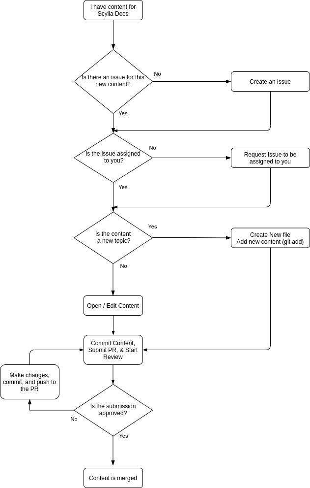

===================================
Scylla docs contributor’s handbook
===================================

If you are reading this guide because you have decided to contribute to Scylla Documentation, thank you!
We appreciate your contribution and hope that this handbook will answer any questions you may have.

The purpose of this handbook is to explain how to contribute new content to Scylla Docs either as a new topic or by editing an existing topic.

If you feel something is missing from this document, do not hesitate to let us know. You can use the Feedback button at the bottom to open an issue.

About Scylla Docs
-----------------

Scylla Docs contains all of the user documentation for installing, maintaining, administering, and developing applications for the Scylla Database.
Each project in the ScyllaDB organization is hosted on GitHub.
For most of the projects, there is a dedicated ``docs`` folder where all of the documentation for that project is stored.
All projects have a file called ``README``. Consult the README file for more specific information on any individual project.

How we write
============

Documentation is written primarily for developers and database administrators.
All documentation is saved and tracked on GitHub.
We have created a style guide that breaks down the writing rules.

Languages/toolchain we use
==========================

The backbone of the docs is written in reStructuredText and the Documentation is compiled with Sphinx.
Some of our upstream content is written in Markdown and Sphinx also supports Markdown as well.

You will find templates and cheatsheet links later in this document.
You can use them to make sure your document is organized and tagged correctly.

To learn more about our Stack, see :doc:`Toolchain <../getting-started/toolchain>`.

About Issues and Pull Requests
-------------------------------

Any documentation contribution, no matter how small, is made as a pull request (PR) on GitHub. You can use a client, the Web UI, or the command line to manage your PRs.

Workflow for Submissions
------------------------
As all content is submitted as a pull request the following diagram can be used to represent the workflow.

Issue assignment
================

Each repository has an issues page on GitHub.
Doc issues are generally labeled with a documentation or docs label.
Although assignment specifics may change from project to project, please do not work on issues that are not assigned to you.
This avoids working on something someone else is working on.
Also, if there is an issue with any guide and the issue does not exist, please create an issue so it can be tracked.

Guidelines for branch names
===========================

Ask the Maintainer of the project if he/she has any preference for naming branches before you contribute to the repo to avoid any collisions or confusion.
If you are providing both documentation and code, it is recommended to name all of your documentation branches with a doc- prefix.

Write content
=============

When writing content for Scylla, we use an informal topic-based writing approach.
There are three kinds of topics:

* Informational --- Gives an overview of the subject
* Procedural --- Gives instructions on how to use the subject
* Referential --- Gives additional information about the particular topic
* All content must be written in US English. Use as few words as possible and try to keep the reading level to under grade 8. You can use word counters and readability tests to keep the reading level down.

Write procedures
................

Each procedure should have an introductory paragraph (1-3 sentences) which explains what the procedure does, when you should use it, and what benefit the procedure provides.
After the introduction, there should be a numbered list of steps. Use the following guidelines to write the steps:

* Each step should be one single action.
* Steps should be written in clear, simple vocabulary that is easy to follow. If the step includes a code snippet, a screenshot of the expected outcome should follow.
* If the procedure includes changing a configuration, the next step should include how to verify that the configuration change was successful.
* Wherever possible, instructions on how to reverse the action should also be included (not part of the original procedure, but included in a separate procedure.

Scylla Style guide
..................

The Scylla Style guide is being developed. You can view the document `here <https://docs.google.com/document/d/1lyHp1MKdyj0Hh3NprNFvEczA4dFSZIFoukGUvFJb9yE/edit>`_. The style guide outlines the way we write documentation. In short, use this handbook, the style guide, and the templates to write content.
Documentation templates and cheat sheets
In the Scylla-docs project we will store templates which can be used in every Scylla Project.

Templates
.........

Use these templates to create new content. There are templates in .rst and .md for the following documents:

* KB Articles
* General Topics
* Known Issues / Troubleshooting
* Procedures (How To)

Cheatsheets
...........

If you want to use a cheat sheet for Markdown or restructuredText, here are some which are helpful:

* :doc:`Scylla Cheat Sheet <../examples/index>` - samples of |rst| markup.
* `restructuredText Cheat Sheet <https://github.com/ralsina/rst-cheatsheet/blob/master/rst-cheatsheet.rst>`_
* `GitHub Markdown Cheat Sheet <https://github.com/adam-p/markdown-here/wiki/Markdown-Cheatsheet>`_

Best practices for content submission
=====================================

* Always open an issue describing what you want to work on if one doesn't already exist.
* Use GitHub search to see if there is someone else working on the issue already. Look at the open PRs.
* Test the new / changed content using the make preview script. Confirm there are no compilation errors before submitting.
* Give some text to your commit message. Explain why you did what you did. If you changed something in formatting, provide a before and after screenshot.

Test the new/changed content
============================

For more information, see our :doc:`Quickstart guide <../getting-started/quickstart>`.

Submit a pull request (PR)
==========================

We expect that you are aware of how to submit a PR to GitHub. If you are not, please look at this `tutorial <https://guides.github.com/activities/hello-world/>`_.
Every repository handles PRs differently. Some require you to use a template for submissions and some do not.
Make sure to speak with the project’s maintainer before submitting the PR to avoid any misunderstanding or issues.

If you are writing new content it is **highly recommended** to set your PR to a draft state.
For Documentation PRs, the following guidelines should be applicable to all Scylla projects:

* Test the instructions against the product. For all tests you must use a clean, new install unless otherwise specified in the issue.
* Make sure the PR renders with no errors and that make preview does not return any errors.
* Cite the issue you are fixing in the PR comments and use screenshots to show changes in formatting.
* In the subject line of the PR prepend the subject with ``docs:``.

If you have any questions about the process, ask the maintainer of the project you're working on.

Scylla-docs Slack Channel
-------------------------

The `Scylla Users Slack <http://slack.scylladb.com/>`_ has a scylla-docs channel. There you will find the docs team and other enthusiasts about docs.
This channel is public.
