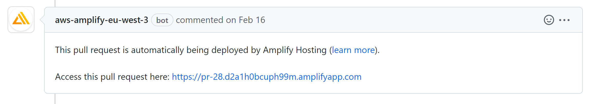
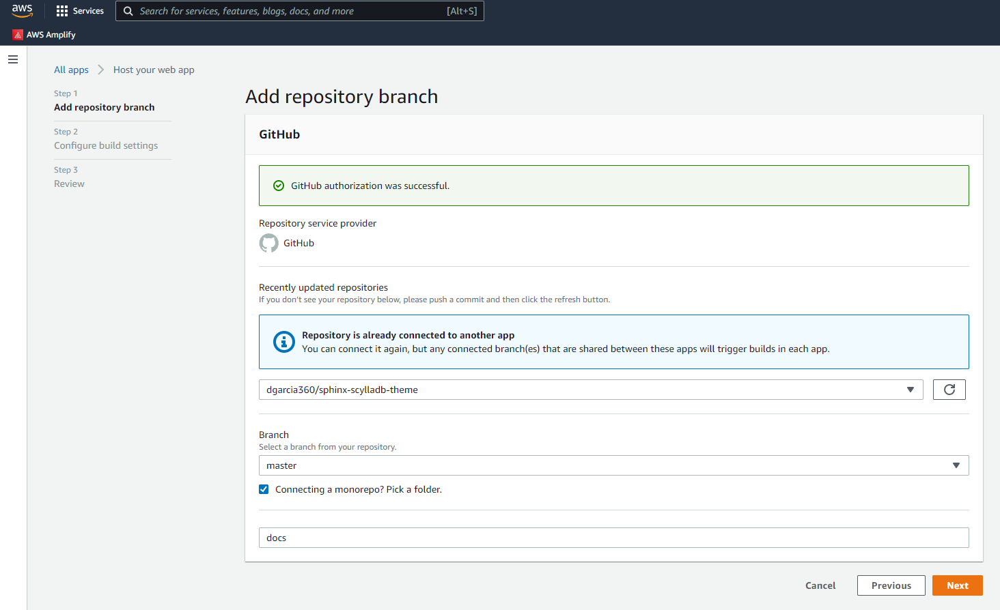

======================
Pull requests previews
======================

.. caution:: This feature is under beta testing and only available for a selected number of projects.

We use `AWS Amplify <https://docs.amplify.aws/>`_ to build a preview site for the docs every time someone sends a pull request that updates the docs folder.

Once the build completes, the pull request receives a message with a link to preview the docs.

On this page, you will learn how to enable pull request previews in a repository with the toolchain installed.

.. _Preview_Installation:

Installation
------------

#. Copy the file `amplify.yml <https://github.com/scylladb/sphinx-scylladb-theme/blob/master/amplify.yml>`_ in the project `root` directory.

#. Commit and push the changes to GitHub (default branch).

    .. note:: To complete the installation, we must list the repository in the company's AWS account. Contact us in Slack (``#scylla-docs`` channel) to set this configuration for you.

Enable previews
---------------

Instructions to enable previews on AWS:

Step 1: Access AWS Amplify
==========================

#. In the company's AWS account, search for **AWS Amplify** in the search console.

    .. figure:: images/amplify-search.png

#. Do one of the following:

    * If you are at the AWS Amplify homepage, click on **Get Started** under **AWS Amplify Hosting**.

            .. figure:: images/amplify-get-started.png

    * Otherwise, click on **New App** > **Host Web App**.

            .. figure:: images/amplify-app.png

#. Select **Import from GitHub**. You might be asked to grant permissions to AWS Amplify in your GitHub account.

    .. figure:: images/amplify-github.png

#. Choose **Continue**.

Step 2: Connect a repository
============================

#. Find the repository you want to enable pull request previews.

#. Set the default branch (e.g. ``master``).

#. Check **Connecting to a monorepo?** and pick the folder ``docs``.

#. Choose **Next**.

.. _configure_build_settings:

Step 3: Configure build settings
================================

#. Under **Build and test settings**, you should see the message "We detected ``amplify.yml`` in your repository and will use it to deploy your app.". If it is not the case, review :ref:`Installation <Preview_Installation>`.

    .. figure:: images/amplify-build.png

#. Expand **Advanced settings** and set **Build image** to ``python:3.8``:

    .. figure:: images/amplify-image.png

Choose **Next**. On the **Review** page, choose **Save and deploy**.

Step 4: Enable pull request previews
====================================

#. On the left sidebar, go to **Previews** page and choose **Preview Settings**.

    .. figure:: images/amplify-preview-settings.png

#. Select the default branch from the list and choose **Manage**.

    .. figure:: images/amplify-preview-manage.png

#. Turn on pull request previews.

    .. figure:: images/amplify-preview-enable.png

The next time you submit a pull request for the branch, AWS Amplify will build the docs automatically and share a preview URL as a pull request comment.

.. _enable_previews_doc_folder_updated:

Build previews only if the docs folder is updated
-------------------------------------------------

To build pull-request previews only if the pull-request edits the docs folder, set the following environment variables on your AWS Amplify application:

.. code-block::

    AMPLIFY_DIFF_DEPLOY = true
    AMPLIFY_DIFF_DEPLOY_ROOT = docs
    AMPLIFY_SKIP_BACKEND_BUILD = true

Preview:

    .. figure:: images/amplify-env.png

For more information on how to set environment variables, see the `Environment variables <https://docs.aws.amazon.com/amplify/latest/userguide/environment-variables.html#setting-env-vars>`_ section  on AWS Amplify docs.

Block a user from triggering previews
-------------------------------------

Code owners and third-party contributors can build pull request previews.
To ban abusive users, see `Blocking a user from your organization <https://docs.github.com/en/communities/maintaining-your-safety-on-github/blocking-a-user-from-your-organization>`_.

Limitations
-----------

- Previews builds have a 15 min limit. Nevertheless, we recommend you make sure the command ``make dirhtml`` does not take more than 3 minutes to build on average.
- Even if your repository is private, all the pull requests previews will be publicly available by default.
- AWS deletes previews when the pull request gets merged or closed.
