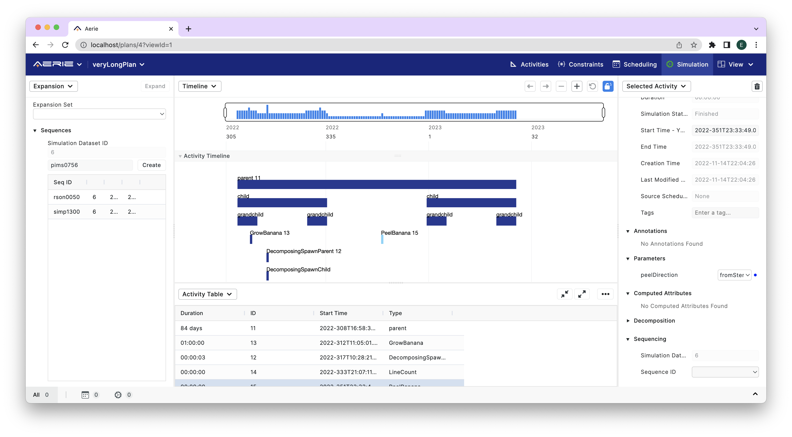

==========================
Expansion Output Sequences
==========================

The output of Aerie expansion are not only time ordered commands per activity, but rather complete sequence products. These sequences can contain commands from multiple activities from a simulation data set. Users can query these sequences through the Aerie API, to get them in the seqJSON format. In order to generate these sequences, Aerie requires sequence ids (seqIDs) to be declared, and mapped to simulated activities. To do so, users first should open the expansion panel in the Aerie planning UI, from any open panel as shown below.  

Adding Sequences to a Simulation Data Set
-----------------------------------------

.. note::

  Limitation: Since Aerie expands simulated activities from a simulation data set, currently we only allow seqIDs to be associated with the simulation data set. This means that when users re-run a simulation, seqIDs have to be declared again for the new simulation data set.  We are exploring several options to mitigate the rework. 

The recommended order of operations is: finalize activity plannning, run simulations, declare sequences, map activities to sequences, and trigger expansions. The image below lists all sequences declared for the last simulation data set. To declare a new sequence, simply type the seqID and press **Create**.

Assigning seqIDs to Activity Directives
---------------------------------------

After the seqIDs are declared, they must be associated with the simulated activities. To do so, open the **Selected Activity** panel, and scroll down to the **Sequencing** section as shown on the bottom right corner of the image above. Clicking on the Sequence ID input field lists all of the declared sequence IDs and allows the user to choose one. Note that this assoaciation is the mechanism for mapping expansion output of multiple activities to the same sequence output. 

.. note::

  Aerie recommends automating the seqID declaration and seqID-activity asscoation steps using Aerie API, such that the information can be recreated automatically after every simulation run. 

  Aerie currently does not support time sorting commands from multiple activities. The commands will be added to the sequence in the order of activity start times. 