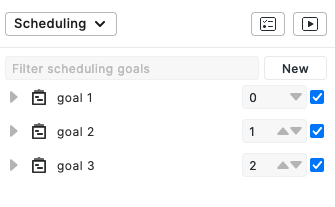

=====================
Running the Scheduler
=====================

Scheduling Specification
========================

After you have created one or several goals, you will see them in the scheduling pane of the plan.

The Aerie scheduler accepts a list of goals, and tries to satisfy them one by one by adding activities to your plan.
We refer to this list of goals as a **scheduling specification**. Aerie creates one scheduling
specification per plan. A goal's **priority** is simply a number reflecting that goal's position in the scheduling
specification. The first goal will always have priority ``0``, and the n-th goal will always have priority ``n - 1``.
Within a scheduling specification, a scheduling goal can be toggled enabled or disabled. A disabled scheduling goal
will be excluded from scheduling execution. The priority ordering of the scheduling goals remains unchanged whether
a goal is enabled or disabled.

In this image, you can see a specification with three goals. ``goal 1`` has priority 0 and ``goal 3`` has priority 2.
You can modify the priorities directly by typing numbers or use the arrows.

To disable a goal, toggle off

.. warning::
  You must use priorities in the [0, n-1] range, n being the number of goals.

When updating a specification, a successful update will result in a green notification

and a failure will result in a red notification

.. image:: img/failure.png
  :width: 400

If this happens, make sure the priorities lie in [0, n-1].

Running the scheduler
=====================

.. tabs::

  .. group-tab:: User Interface

    To run the scheduler, click on the play button

    .. image:: img/click-scheduling-scheduling-panel.png
      :width: 400

    If the scheduler fails, a failure icon will appear next to the buttons

    .. image:: img/scheduling-failed.png
      :width: 400

    An error message will also appear in the bottom error panel. For example:

    .. image:: img/scheduling-error.png
      :width: 800

    If scheduling has succeeded, some information about the satisfaction of the goal appears next to each goal. For example

    .. image:: img/scheduling-success.png
      :width: 400

    * The round blue checkmark means that the goal is completely satisfied
    * 174 means that there are 174 activities that contribute to the satisfaction of the goal
    * +3 means that 3 new activities have been inserted in the plan to satisfied the goal during the last scheduling run

  .. group-tab:: API

    Coming soon.

      Example: run the scheduler

      .. code-block::

        query Schedule{
          schedule(specificationId: 1){
            reason
            status
            analysisId
          }
        }

Running a Scheduling Analysis
-----------------------------
.. tabs::

  .. group-tab:: User Interface

    The scheduler has an analysis mode that will evaluate the satisfaction of goals but will not place any new activities.
    To run the scheduler in analysis mode , click on the other button.

    .. image:: img/click-analysis-scheduling-panel.png
      :width: 400

    Information about the satisfaction of the goals will be the same as when the scheduler is ran (see section above).

  .. group-tab:: API

    Coming soon.
