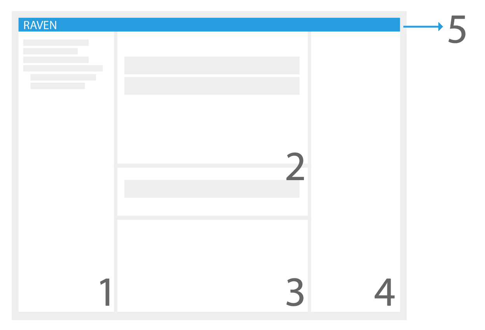
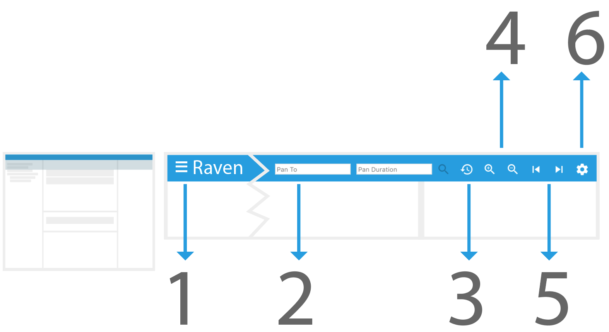
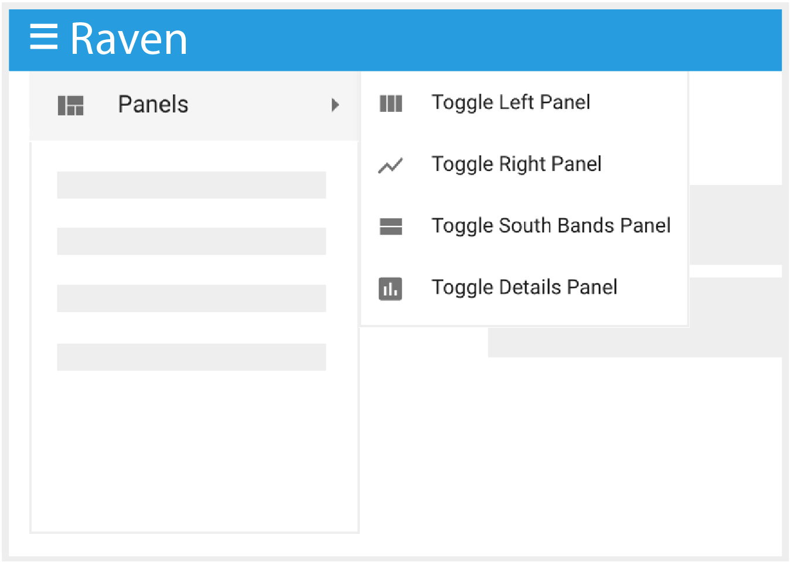

# RAVEN 101: Application Layout

*
**Image 1.** Once RAVEN is loaded, the following containers will be displayed: (1) the Source Explorer, (2) the Bands Panels, (3) the Details Panel, (4) the Right Panel and (5) the Top Bar.
*

## Containers

#### 1 - Source Explorer Panel 

The Source Explorer Panel displays the available data in a tree-like format. The user can navigate through the tree to select various data sources to visualize. Please refer to the [Source Explorer Section](./Raven_101_2_source_explorer.md) for more details.

#### 2 - Bands Panels 

RAVEN displays the data to visualize in the "Bands Panels". These are: the "Main Bands" Panel and the "South Bands" Panel. When a graphable source is selected from the Source Explorer, RAVEN will fetch its data and create a band that visualizes the contents. This new band will be added, by default, to the "Main Bands Panel". The user has the option to [select a band](./Raven_101_3_bands.md#how-to-select-a-band) and move it between panels for organizational purposes. 

#### 3 - Details Panel

When a band is selected from one of the "Bands Panels", the "Details Panel" is populated with all the data points related to that specific source. The information provided includes: start time, end time, value of the data point, metadata, and more. When a data point is selected, the "Details Panel" will scroll to its location and highlight it.

#### 4 - Right Panel

The "Right Panel" consists of the following tabs:

###### Selected Band Tab

When a [band is selected](./Raven_101_3_bands.md#how-to-select-a-band), the "Selected Band" tab will show options to manipulate how the data is visualized. For each type of band there are different options available, please refer to the [Band Type Specific Options Section](./Raven_101_3_bands.md#band-type-configuration-options) for more information.

###### Selected Point Tab

When a [data point is selected](./Raven_101_3_bands.md#how-to-select-a-data-point), the "Selected Point" Tab will display more details about the data point.  The  information displayed will include: start time, end time, and value of the data point metadata. 

#### 5 - Top Bar

*
**Image 2**. The Top Bar contains the (1) Main Menu Button, (2) 'Pan To' Options, (3) Reset Time, (4) Zoom In/Out, (5) Pan Left/Right and (6) the Global Options.
*

The Top Bar contains the [Global Settings Options](./Raven_101_3_bands.md#global-settings) (), the Main Menu () and other options to [manipulate the view range](./Raven_101_3_bands.md#how-to-manipulate-time-range) of the timeline. When bands are added, the Global Settings Options will configure default values. Some examples of this functionality include: changing the default line color, adding dividers, updating the width of the labels and more. Please refer to the [Global Settings Options](./Raven_101_3_bands.md#global-settings)  for more detailed information.

The Main Menu displays options such as: Manipulation of the Layout, Management of Output, Time Cursor and Epochs, Get Shareable Link and get information about RAVEN which will provide RAVEN's version and the copyright statement. 

### How to: Manipulate the Application Layout

*
**Image 3.** Available options to manipulate the panels in the application layout.
*

1. In the Top Bar, open the Main Menu by clicking on the "hamburger icon" ().
2. In the dropdown, select the Panels option. 
3. A list of options to toggle the visibility of RAVEN's panels appear. Select one of the options to toggle the selected panel in the application.

<a href="./Raven_101_2_source_explorer.md">Next: Source Explorer</a>

