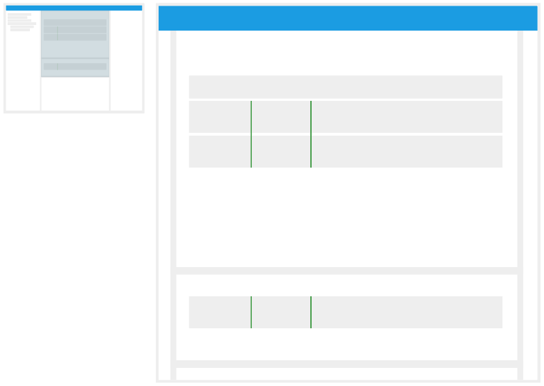
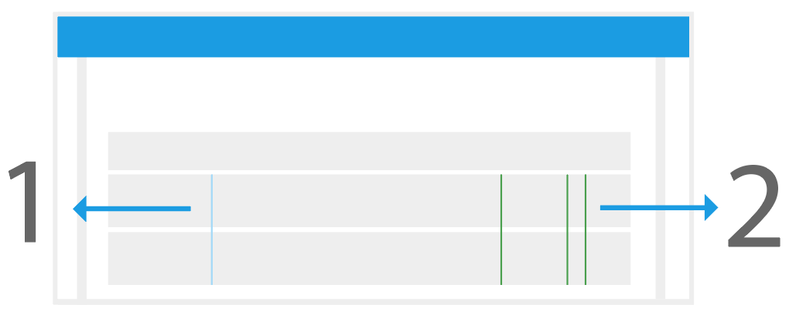

# Guides

*
**Figure 16:** Guides are green lines across all the data bands in the Bands Panels.
*

Users can add guides to mark a point in time to all the data bands drawn in the Bands Panels. The user can turn on the `Show Last Click` option in the [Global Band Settings](./Raven_101_3_bands.md#global-settings) panel. If `Show Last Click` is on, when the user clicks any band at any point in the timeline, it will add a Ghost Line marking to the selected time as shown in **Figure 17**. It is **important** to note that the Ghost Line is not the guide itself, as guides are colored green and exhibit perminence. Guides will be created on the last selected point in time, which can be represented by the Ghost Line.

*
**Figure 17: Guides and Ghost Line.** (1) Guides are represented with green lines crossing all drawn bands. (2) The Ghost Line will be displayed if the user clicks at any time and has the `Show Last Click` option **On**. The Ghost Line is represented with a light blue line across all drawn bands.
*

#### How to: Add a Guide
1. Click at any point in the timeline where you want the guide to be added. If `Show Last Click` is on, a Ghost Line will be added as shown in **Figure 17**.
2. In the top bar, look and click the `Create Guide` icon () to create a guide. A green line will be added to the bands at the selected time as shown in **Figure 17**.

#### How to: Delete a Guide
1. Select a guide that you wish to remove in the timeline.
2. In the top bar, click the `Remove Guide` icon (). The selected Guide should be removed. 

#### How to: Delete All Guides
1. In the top bar, click the `Remove All Guides` icon (). 
2. A confirmation dialog will appear. 
3. Click `Yes`. All guides should be removed.

<a href="./Raven_101_4_time_cursor.md">Next: Time Cursor</a>

