# Bands

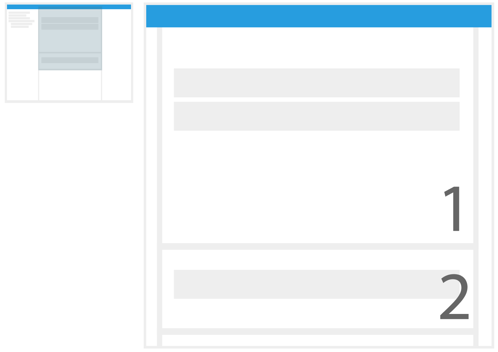

*
**Image 8.** Bands represent the selected sources in the Source Explorer, displaying one or more data sources per band. There are two panels: (1) the Main Bands Panel and the (2) the South Bands Panel. The user can move the bands between both panels and arrange their order if desired.
*

A band is how timeline data is presented within RAVEN. When a data source is selected a band is added to the Main Bands Panel and its data is displayed. There are three different band types that the user can add: Activity, Resource and State Bands. 

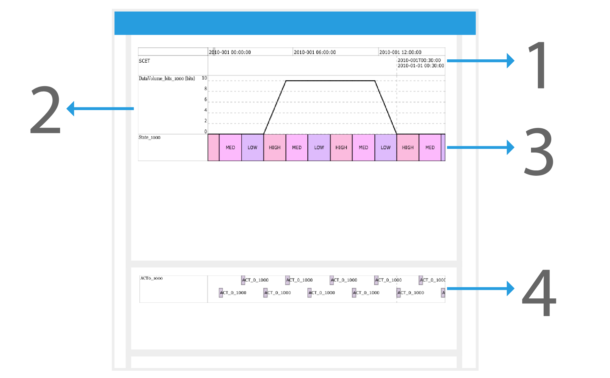

*
**Image 9: Band Types.** When a band is added for the first time, the (1) Timeline Band is also added to the Main Panel. This Band displays the "view time range" among all the bands. You can hover over this band to see the timestamp or brush on it to change the viewing range. There are 3 different kinds of bands to display data: (2) Resource Band, (3) State Band and (4) Activity Band.
*

Each band type has its own settings that can be modified. In order to perform this action, you need to select a band and the right panel will show the available configuration options.

#### How to: Select a Band

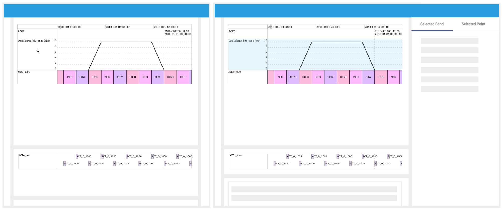

*
**Image 10: How to select a band.** Left side: Click on the band's label area. Right side: As a result of the selection, the band will be highlighted, the details panel will display the bands data points in a table and the Selected Band Tab in the right panel will be populated with the configuration options for the selected band.
*

Given a band exists in the Bands Panel, click the band in the label area.  Selecting a band will trigger the following actions:  the band's background will be highlighted with a light blue; The Details panel will populate a table with the source's data points; and The Right Panel will display the Band's configuration options in the Selected Band Tab. 

## Global Settings

The global settings will apply to all the bands once the options are changed.

| Option                      | Description                                                  |
| --------------------------- | ------------------------------------------------------------ |
| Label Width                 | Defines the width of the label area for each band.           |
| Show Tooltip                | If On, the tooltip will be displayed. The tooltip appears in three areas: the band's label area, timeline band and for each the data point when hovering the band. |
| Show Last Click | If On, when the user clicks any band at any point in the timeline, it will add a light blue 'ghost' line marking the selected time. |
| Default Activity Layout     | Sets the default value for the activity layout when activities are added in the future. |
| Default Label Font          | Defines the font of the label for each band.                 |
| Default Resource Color      | Sets the default value for the line color when resources are added in the future. |
| Default Resource Fill Color | Sets the default value for the fill color when resources are added in the future. |
| Default Icon                | Sets the default icon for when activities and resources are added in the future. |

## Band Configuration Options by Type

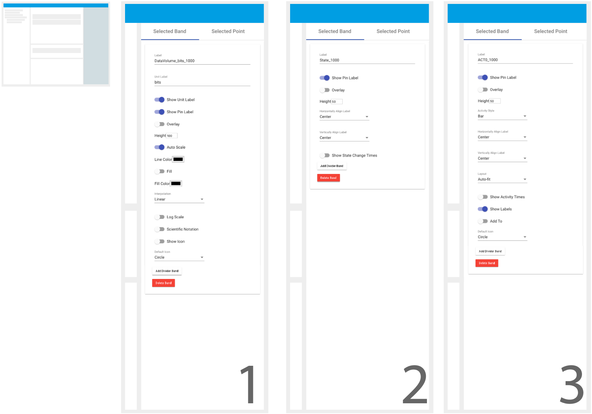

*
**Image 11.** Selected Band Configuration Options by Band Type for (1) the Resource Bands, (2) the States Bands and (3) the Activities Bands.
*

#### Common Options 

These are the configuration options shared among all the band types.

| Option           | Description                                                  |
| ---------------- | ------------------------------------------------------------ |
| Label            | Defines the label displayed in the Band                      |
| Height           | Defines the height of the band.                              |
| Delete Band      | On Click, the user will have the option to remove a band from the Bands Panels. |
| Overlay          | If this option is Turned On, future selected sources will be displayed on top of the band. Please refer to [Overlay Bands Section](#overlay-bands) for more details. |
| Show Pin Label   | If this option is Turned On and the selected source is the child of a pin, it will append the pin name to the band's label. |

#### Resource Band Options

| Option                 | Description                                                  |
| ---------------------- | ------------------------------------------------------------ |
| Unit Label             | Defines the unit label that is appended to the band's label. |
| Show Unit Label        | If this option is Turned On, the Unit label will be appended to the band's label. |
| Auto Scale             | If this option is Turned On, it will calculate the y-Axis ticks based on the current range view. |
| Line Color             | Defines the color of the resource's line.                    |
| Fill                   | If this option is Turned On, it will fill the chart from the line to the bottom. |
| Fill Color             | Defines the color of the resource's fill.                    |
| Interpolation          | Defines the interpolation of the chart. Options: Constant, Linear and None. |
| Log Scale              | If this option is Turned On, it will calculate the log for all the data points and graph them. |
| Scientific Notation    | If this option is Turned On, the yAxis ticks will be represented with scientific notation. |
| Show Icon              | If this option is Turned On, icons will be show for each data point. |
| Default Icon           | If Show Icon is On, the selected Icon will be the one displayed for each data point. Options: None, Plus, Cross, Circle, Triangle, Square and Diamond. |
| Composite Y-Axis Label | If this option is Turned On and if there are two or more resource band types overlaid, then the Y-axis will works as a one. In addition, options like `Scientific Notation`, `Log Scale` and `Auto Scale` will be applied to the composite y-axis. |

#### State Options

| Option                   | Description                                                  |
| ------------------------ | ------------------------------------------------------------ |
| Horizontally Align Label | Will align the label of each data point horizontally. Options are: Left and Center. |
| Vertically Align Label   | Will align the label of each data point vertically. Options are: Top, Bottom and Center. |

#### Activity Band Options 

| Option                | Description                                                  |
| --------------------- | ------------------------------------------------------------ |
| Layout                | Defines how the activities are displayed in the Band. Options are (1) Autofit (2) Waterfall and (3) Packed. 
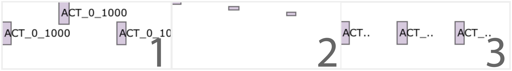
 |
| Activity Style        | Defines how the data points will be displayed. Options are (1) Bar, (2) Icon and (3) Line. 
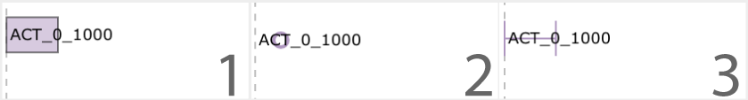
 |
| Horizontally Align    | Will align the label of each data point horizontally. Options are: Left and Center. |
| Vertically Align      | Will align the label of each data point vertically. Options are: Top, Bottom and Center. |
| Show Activities Times | If On, it will show at what time an activity starts and ends in the bottom of the activities.
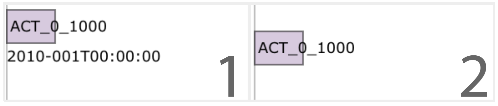
 |
| Add To                | If On, future selected sources will add the data points to the same band. |
| Default Icon          | If Activity Style is set to Icon, the selected Icon will be the one displayed for each data point. Options: None, Plus, Cross, Circle, Triangle, Square and Diamond. |
| Show Labels           | If On, labels will be shown for each data points.            |

#### Divider Band Options

| Option            | Description                                |
| ----------------- | ------------------------------------------ |
| Background Color  | Sets the background color of the divider.  |

#### How to: Overlay Bands

Overlaying bands allows for multiple data sources of any type to be overlaid within the same timeline band.    To overlay multiple bands:

1. Add a band using the [steps above](./Raven_101_3_source_explorer.md#select-a-source). 

2. Select the band by clicking in the label.

3. In the Selected Band Tab in the Right Panel, toggle the overlay option on. 

4. Select another source of your preference. The band of this last selected source will be added in the same band from step one.

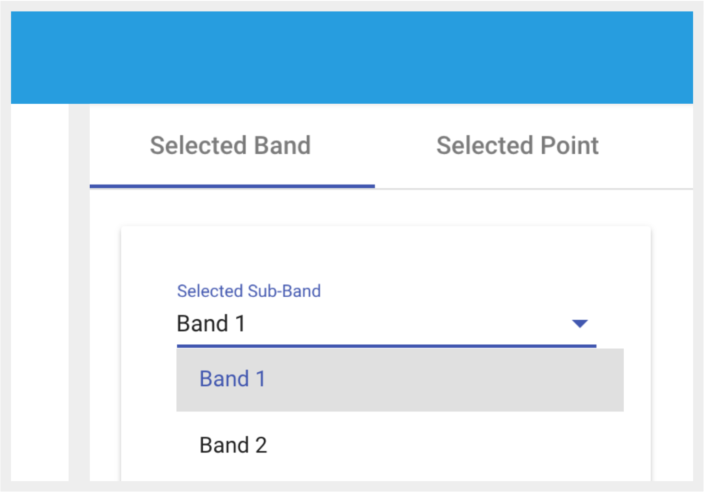

*
**Image 12.** When a band is overlaid, the Selected Band Panel will add a Selected Sub-Band option. This will allow the user to change the properties of both overlaid sources. In the case that the user uses 'Add To' instead of 'Overlay' this option will not be provided, since the data points for both sources will exist in the same band.
*

#### How to: 'Add To' Activity Bands

'Add To' is similar to overlaying bands, however is specific for Activity Bands. The activities will be added in line with different activity sources within the same band.  The activities will not overlap eachother and be arranged as if the activities were drawn from a single data source.  

1. Add an activity band using the [steps above](./Raven_101_3_source_explorer.md#select-a-source). 
2. Select the band by clicking the label.
3. In the Selected Band Tab in the Right Panel, set true the 'Add To' option.
4. Select another source of your preference. The data points of this last selected source will be added in the same band from step one.

#### How to: Add Divider Band

Divider bands are use as separators of different band groupings. If the user wants to add a band in a specific location, a band can be selected and when the user adds a band it will be added after the selected band. 

1. In the top bar look for the divider icon () and click it.
2. A divider band will be added in the bands panel.

#### How to: Manipulate Time Range

There are different ways to change the view range for your bands. From the Top Bar you can execute Pan To, Zoom In/Out, Pan Left/Right, and Reset Time. From the Time Band you can brush and execute pan, and also move the view frame among the entire band's frame.

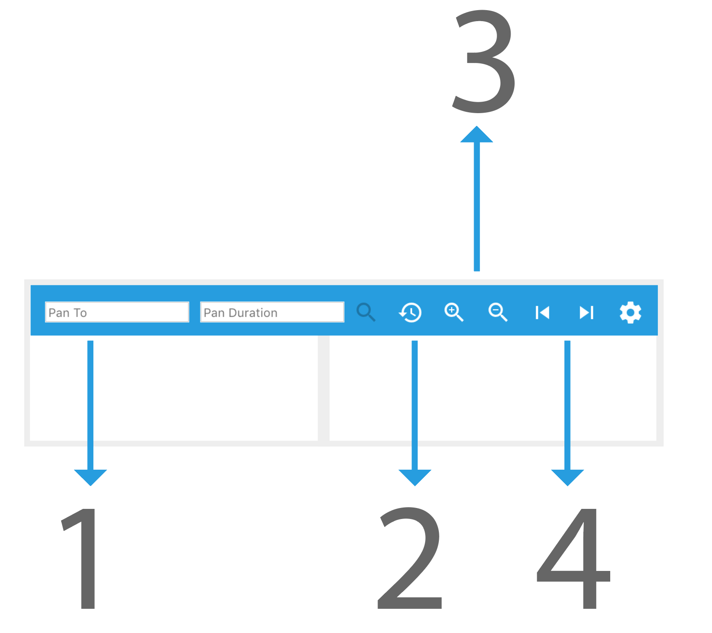

*
**Image 13.** The Top Bar contains options to update the view range such as:  (1) 'Pan To' Options, (2) Reset Time, (3) Zoom In/Out, and (4) Pan Left/Right Options.
*

###### Pan To

To Pan to a specific location on the timeline, 

1. Enter the start time in the 'Pan To' input field located in the Top Bar.
2. Enter the desired 'Pan Duration' for the view range. As a result, the end time will be equal to the start time + duration.
3. Click the magnifier icon ().

###### Reset Time

To 'Reset Time', click the Reset Clock Icon in the Top Bar  ().

###### Zoom In/Out

- To 'Zoom In', click the Zoom In Icon in the Top Bar ().
- To 'Zoom Out', click the Zoom Out Icon in the Top Bar ().

###### Pan Left/Right

- To 'Pan Left', click the Left Arrow Icon in the Top Bar ().

- To 'Pan Right', click the Right Arrow Icon in the Top Bar ().

###### Brush the timeline band

To zoom your view range from the timeline bar,

1. Click and hold in the timeline bar where you want the view range to start.

2. Move the cursor left or right defining the length of the view range that you desire.

3. Release the cursor.

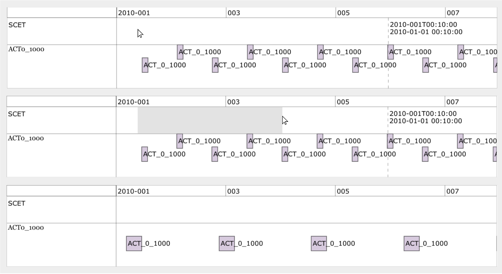

*
**Image 14. How to: Execute Brush in the Timeline.** Top side: Click and hold at any place where you want to start or end your view range. Middle Side: Move your cursor left or right and release the cursor once the desired duration is selected. Bottom side: All the bands in the Bands Panels will update their view based on the user's selection.
*

#### How to: Select a Data Point

To select a Data Point, click on the data point of your preference. When a data point is selected, the 'Selected Point' Tab will display more details about the data point.  Provided data will include start time, end time, value of the data point metadata and more.

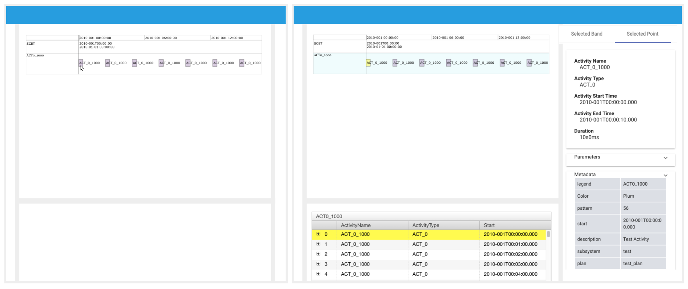

*
**Image 15: Select a Data Point.** Left side: On a band of your preference, click any data point. Right Side: Once a data point is selected, the details panel will scroll and highlight the selected data point. Also within the 'Selected Point' Tab in the Right Panel, the data point's metadata will be displayed.
*

##### How to: Expand Activity Data Points
| Option            | Description                                |
| ----------------- | ------------------------------------------ |
| No Expansion | Displays only the parent activity.|
| Children Expansion | Displays the immediate children of the selected activity. | 
| Descendants Expansion  | Displays all the descendants of the selected activity (Children of Children). |

1. Make sure that you have an activity band in the bands panels.
2. Select an activity data point in the band.
3. Make sure that you have the `Selected Point` tab in the right panel open.
4. Look for the Activity Selection Dropdown, and here you will have three options: No Expansion, Children Expansion and Descendants Expansion.
5. Select the desired expansion.

#### How to: Remove all Bands

To remove all the drawn bands:

1. In the Top Bar, click the Remove All Bands Icon ().
2. A confirmation dialog will appear. 
3. Click `Yes`. All bands should be removed.

<a href="./Raven_101_3.1_guides.md">Next: Guides</a>

