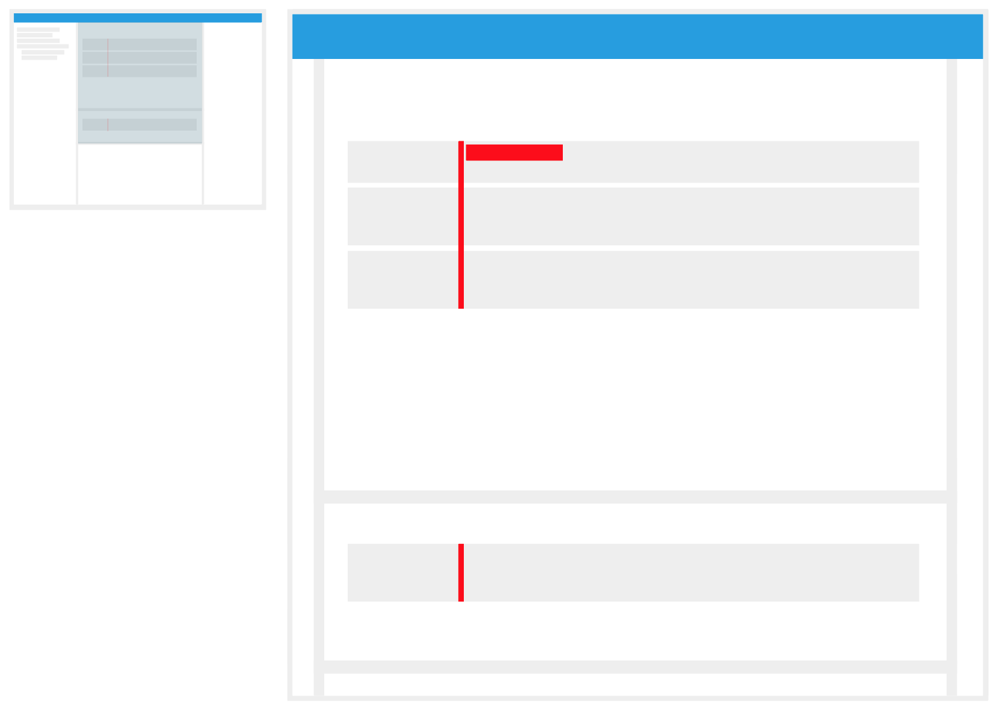
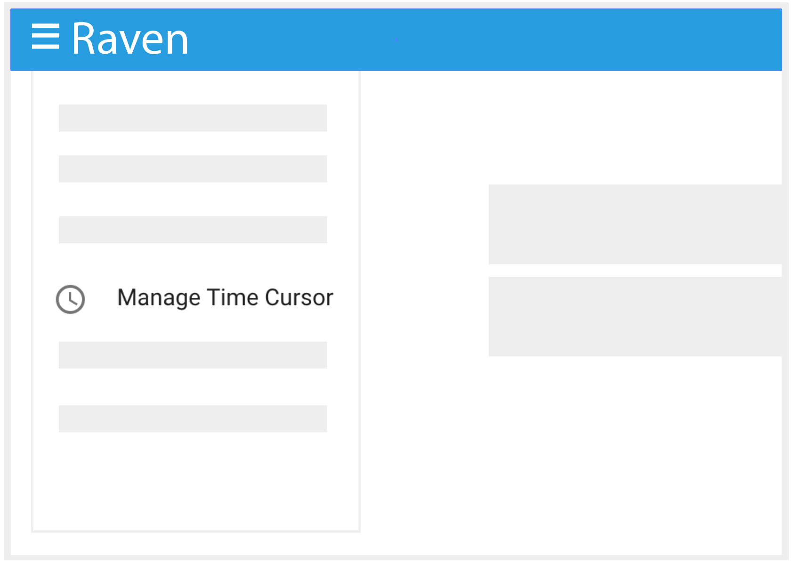
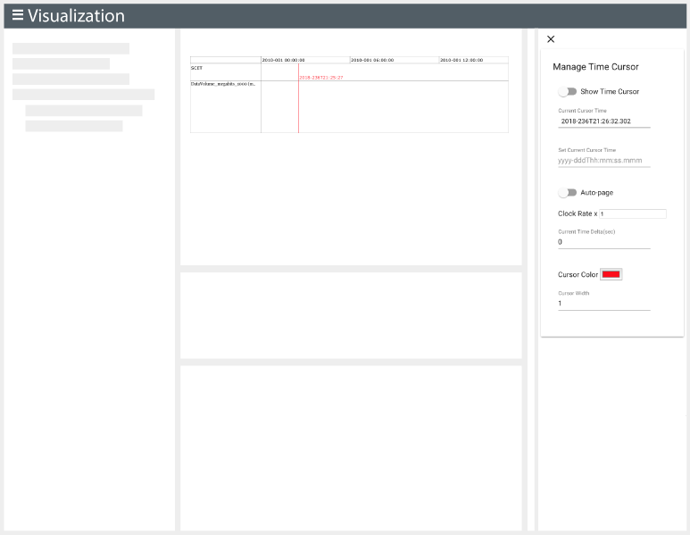

# Time Cursor

The time cursor marks the time passing among all the bands in the timeline. It will be represented with a line of the user's preference color and it will move at the defined rate.

*
Image 1: Time cursor displayed among all the bands in the main and south Bands panels.
*

#### How to Add a time cursor

1. Add a band of your preference. To do so, [select a graphable source in the Source Explorer](./Raven_101_3_source_explorer.md#select-a-source).

2. In the Top Bar, open the Main Menu. To do so, click the hamburguer icon ().

3. In the Dropdown, select the `Manage Time Cursor` option.

   

   *
Image 2: Where in the Application is the Manage Time Cursor Button.
*

4. A new drawer will be displayed with the Time Cursor options.

5. Toggle `Show Time Cursor`. By default, if the `Set Current Cursor Time` is not defined, RAVEN will use the actual current time.
6. Copy the value in the `Current Cursor Time` field.
7. Execute Pan in the Top Bar using the copied value from step 4 for the `Pan To` field and set the `Pan Duration` to `5m`.

*
Image 3: **Time cursor added in the application.** Note that in the left side of the application a drawer to Manage Time Cursor is opened. `Other Options Section` will provide details.
*

### Other options

| Option                  | Description                                                  |
| ----------------------- | ------------------------------------------------------------ |
| Show Time Cursor        | Will toggle the view of the time cursor in the timeline.     |
| Current Cursor Time     | Defines where in the timeline is the time cursor. By default it will be set to the actual current time. |
| Set Current Cursor Time | The user can manually enter where the time cursor should start. |
| Auto-Page               | If On, when the time cursor reaches the left side of the timeline, the time range will update so that the time cursor is always visible. |
| Clock Rate              | Defines the rate that the cursor moves in time.              |
| Current Time Delta      | When the time cursor doesn't have a manual `Set Current Cursor Time` value defined, the value assigned in this field will be added to the actual current time. |
| Cursor Color            | Defines the color of the cursor. By default is red.          |
| Cursor Width            | Defines the width of the cursor.                             |

<a href="./Raven_101_5_states_layouts_shareable_links.md">Next: States, Layouts and Shareable Links</a>

