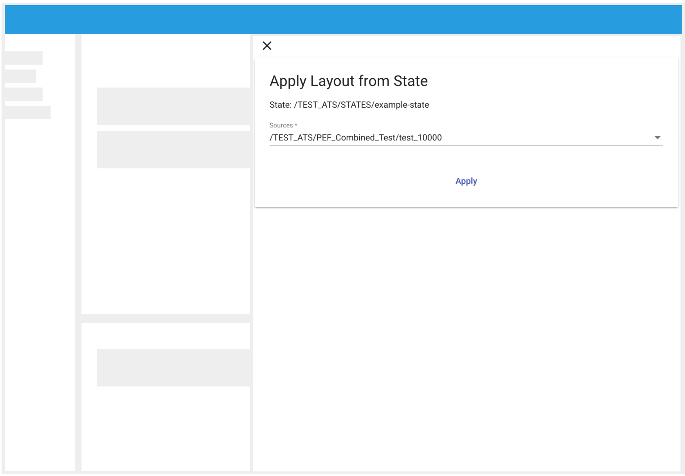
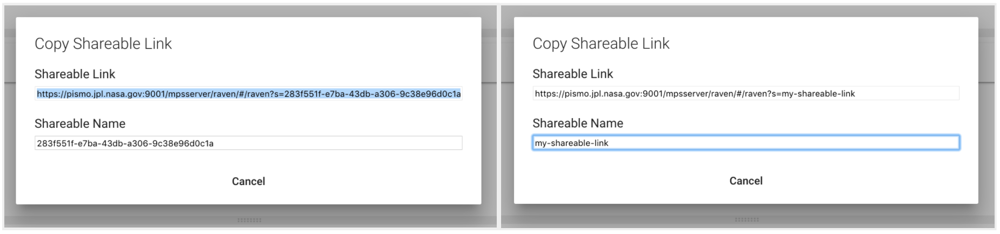

# States, Layouts and Shareable Links

When the user desires to save and recover their data display in a future; States, layouts and shareable links provide this functionality.

## States

A state saves all the bands, bands options, view range and all the items that the user added and customized at the moment a state was saved. A user can save their state anywhere in the source tree where allowed to do so.

#### How to: Save a State

1. Select a Database. 
2. Click the snowman icon ().
3. In the dropdown, select: 'Save'.
4. A dialog will open requesting a name for the state.
5. Click 'Save'. In the selected database the state should be added with the designated name.


#### How to: Apply as a State

1. In the Source Explorer browse for a state to load. 
2. Select the item, to do so click on it's name.
3. Click the snowman icon ().
4. In the dropdown, select 'Apply'.
5. Another dropdown will be displayed, select 'State'.
6. A dialog will appear asking for permission to remove the current state of the application. Press `Yes` to proceed. All the bands, the view range and the customized options will be restored.


#### How to: Update a State

1. Create a new state to host the result of the existing state.
2. Select a Database where the state that you want to update is contained.
3. Click the snowman icon ().
4. In the dropdown, select: `Save`.
5. A dialog will enter the same name of the state that you want to update. A warning of rewriting will be displayed.
6. Click `Save`. The state should be updated.


#### How to: Remove a State

1. Browse in the Source Explorer for a state. 
2. Select the item by clicking on it's name.
3. Click the snowman icon ().
4. In the dropdown, select: `Delete`.
5. A dialog will appear prompting for permission to proceed. Press `Yes` to continue.


## Layouts

Some of the available collections or databases share the same structure. A state can be saved as a template to apply the same options from another collection or database.

As an example, use the following tree:

```
+-- Collection-a
|	+-- source-a
|  	+-- source-b
+-- Collection-b
|	+-- source-a
|  	+-- source-b
```

both `Collection-a` and `Collection-b` contain sources with the same names. Assume there exists a state, let's call it `example-state`, that contains the band:  `Collection-a > source-a`. If the user wants to apply the same structure to `Collection-b`, then the user can apply `example-state` as a layout to `Collection-b`. The result will be that the only band that will is added to the "Bands Panel": `Collection-b > source-a`.

#### How to: Apply a state as a layout

1. Browse the Source Explorer for a state.
2. Open the nodes for the sources that you want to apply this state as a layout.
3. Select the item by clicking on its name.
4. Click the snowman icon ().
5. In the dropdown, select: `Apply`.
6. Another dropdown will be displayed, then select `Layout`.
7. A drawer will appear in the right-hand side of the application.
8. A dropdown will show, displaying states and opened sources in the source explorer. Select the sources.
9. Click `Apply`.
10. A dialog will appear prompting for permission to proceed. Click `Yes` to continue.

<p align="center"></p>

*<p align="center">**Image 19. Apply as a layout drawer.** When the user desires to apply a state as a layout, the drawer showed in the right side of the application will appear. In the Sources dropdown, the user will be able to select all the sources to which the layout is desired to be applied. </p>*


## Shareable Links

Shareable links helps with the creation of states and their access. When the user wants to share their view with another user a Shareable link can be used. 

#### How to get a Shareable Link

1. In the Top Bar, open the Main Menu by clicking on the "hamburger icon" ().
2. In the Dropdown, select `Get Shareable Link`.
3. A dialog to copy the Shareable Link will appear. 
4. By default, RAVEN will create a random id to generate the Shareable Link. The user also has the option to rename the shareable link. (***Image 20***)
5. Once the shareable link is defined, copy the generated link. When it is in the clipboard, dialog will close automatically.
6. Now, you can open your link in your browser's tab or share it with a college.


<p align="center"></p>

*<p align="center">**Image 20. Shareable link dialog.**  A Shareable Link with a generated unique identifier. (left) A Shareable Link with custom name entered by the user. (right)</p>*

A host folder for the shareble link is defined on RAVEN's settings section. Since a shareable link is a state, the user can access it in the future to load it, update it, and/or delete it.

<p align="right"><a href="./Raven_101_6_export_data.md">Next: Export Data</a></p>
