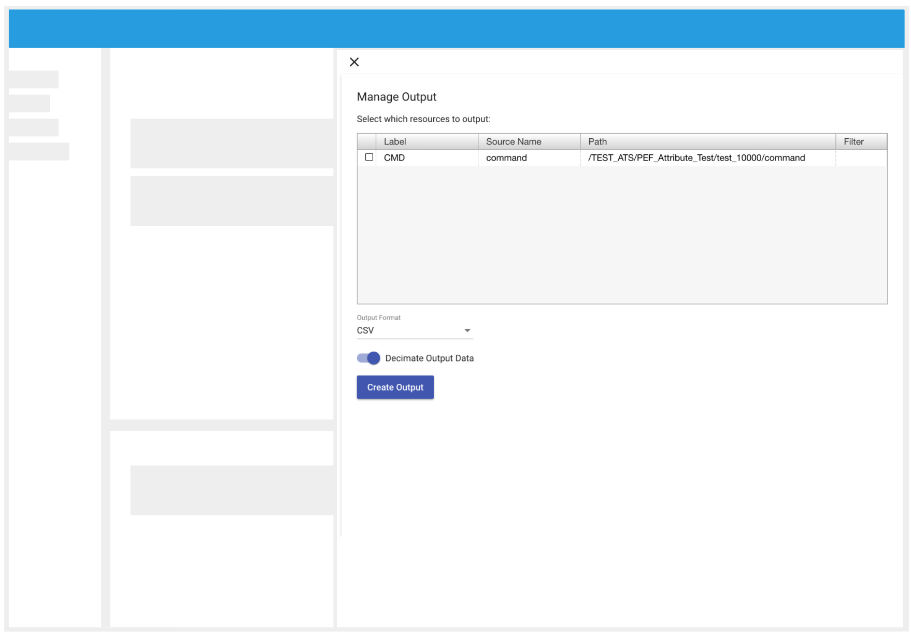
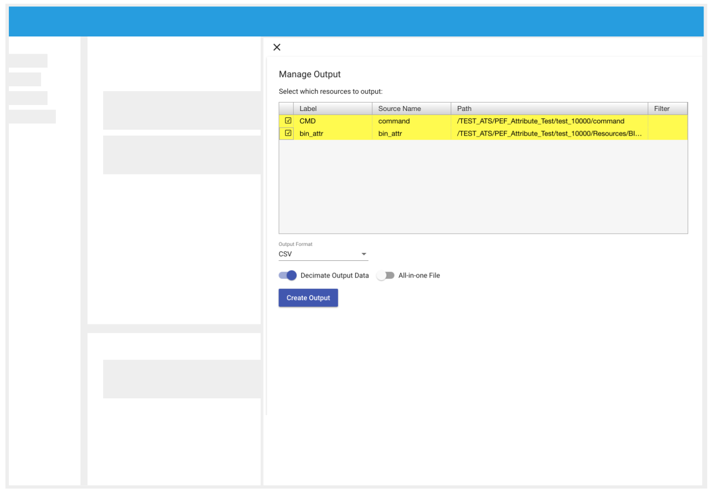
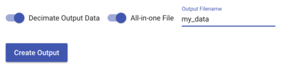

# Export Data

### How to: Export your data

1. Make sure that the data sets you want to download are selected in the Source Explorer.
2. In the Top Bar, open the Main Menu ().
3. In the Dropdown select 'Manage Output'.
4. A drawer will open showing a list of the sources available to download.

*
**Image 21**. Manage Output Drawer. In order to download the data of a selected source, select the it in the table, pick a format and generate the output. 
*

4. A table will be displayed with all the selected sources in the application, check the ones to export.
5. Select the format of the file and whether you want the data to be decimated or not.
6. Click `Create Output`. A file will start downloading.

### How to: Export your data in "All-in-one" file

*
**Image 22.** Manage Output Drawer. When the user selects more than one source, the `All-in-one File` option will be available. 
*

1. Make sure there are two or more data sets selected in the Source Explorer.
2. In the Top Bar, open the Main Menu by clicking on the "hamburger icon" ().
3. In the Dropdown select: `Manage Output`.
4. The `Manage Output` drawer will open showing a list of the available sources to download.
5. A table will be displayed with all the selected sources in the application, check at least two files.
6. Set the  `All-in-one File`  true. 
7. Enter the name for the new file.
8. Click `Create Output`. Your file will start to download.

*
**Image 23.** When the `All-in-one File` option is set to true, the user needs to enter a name for the file. Once entered `Create Output` will be enabled. 
*

<a href="./Raven_101_7_situational_awareness.md">Next: Situation Awareness</a>

