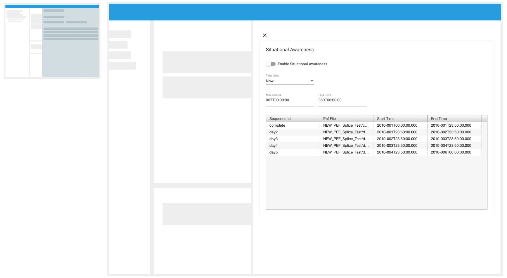
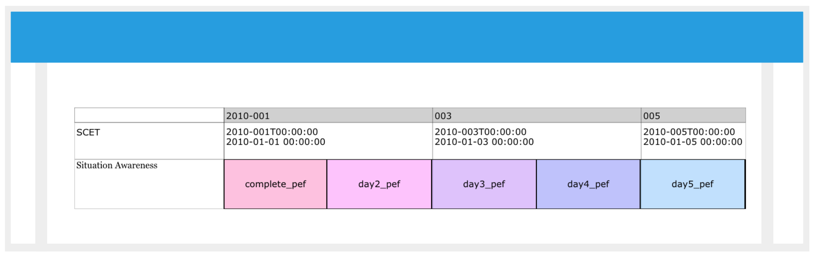

# Situational Awareness

*
**Figure 26. Situational Awareness Drawer.** Situational awareness will read the available sequences and show them to the user. 
*

Situtation Awareness is a mode in RAVEN which allows the timelines to be displayed based on current time or an user specified time. If the current time is selected, the user can specify the plus and minus deltas to provide the page duration. The default minus delta is 7 days and plus delta is 60 days. Hence, the default page duration is 67 days.

In situational awareness mode, RAVEN will only query data for the current time period resulting in an improved performance for timelines spanning a long period. In addition, PEF data can be setup on the server side to be 'stitched' from multiple sequences. Querying PEF data in situational awareness mode will result in portions of timeline data from multiple PEFs stitched together as one continuous timeline rendered in RAVEN.

#### How To: Enable situational awareness

1. In the Top Bar, open the Main Menu by clicking on the "hamburger icon" ().
2. In the Dropdown select: "Situational Awareness".
3. As shown on **Figure 26**, the "Situational Awareness" drawer will appear.
4. Situational Awareness can be enabled in two ways:
   1. Setting Start Time to Now
      1. The "Time Used" dropdown should be set to "Now" which is the default value. 
      2. There are two input fields: "Minus Delta" and "Plus Delta". 
         1. "Minus Delta" is the time that will be substracted from the current time.
         2. "Plus Delta" defines the desired duration after the current time. 
      3. As a result in the view range: 
         1. `start time = current time - minus delta` 
         2.  `duration = minus delta + plus delta` 
   2. Setting a Custom Start Time
      1. Change "Time Used" to "Input Time".
      2. There are two input fields: "Start Time" and "Duration"
         1. "Start Time", defines the start time for the view range
         2. "Duration", defines the duration after the start time for the view range.
5. Set "Enable Situational Awareness" to True. A new band will be added to the timeline with blocks that represent each sequence available to the user, like the one on **Figure 27**. And the range of the bands will be changed to the defined one on step 4.

*
**Figure 27. Situational Awareness Band.** Once Situational Awareness is enabled, a Situational Awareness Band will be added as a map of the available sequences. 
*
