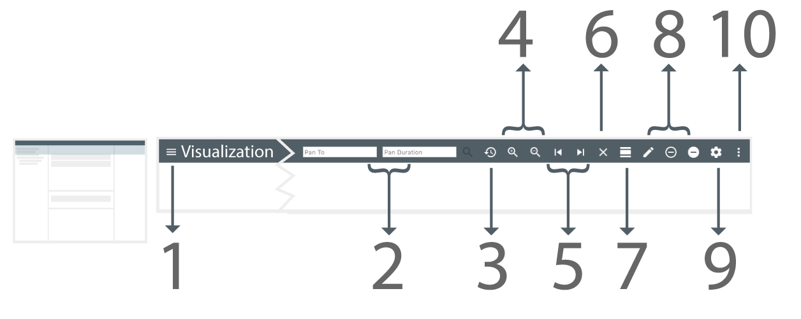

# RAVEN 101: Application Layout

*
**Figure 1.** Once RAVEN is loaded, the following containers will be displayed: (1) the Source Explorer, (2) the Bands Panels, (3) the Details Panel, (4) the Right Panel (5) the Top Bar and (6) the NEST Modules Navigation.
*

## Containers

#### 1 - Source Explorer Panel 

The *Source Explorer Panel* displays the available data in a tree-like format. The user can navigate through the tree to select various data sources to visualize. Please refer to the [Source Explorer Section](./Raven_101_2_source_explorer.md) for more details.

#### 2 - Bands Panels 

RAVEN displays the data to visualize in the *Bands Panels*. These are: the *Main Bands Panel* and the *South Bands Panel*. When a graphable source is selected from the *Source Explorer*, RAVEN will fetch its data and create a band that visualizes the contents. This new band will be added, by default, to the *Main Bands Panel*. The user has the option to [select a band](./Raven_101_3_bands.md#how-to-select-a-band) and move it between panels for organizational purposes. 

#### 3 - Details Panel

When a band is selected from one of the *Bands Panels*, the *Details Panel* is populated with all the data points related to that specific source. The information provided includes: start time, end time, value of the data point, metadata, and more. When a data point is selected, the *Details Panel* will scroll to its location and highlight it.

#### 4 - Right Panel

The *Right Panel* consists of the following tabs:

###### Selected Band Tab

When a [band is selected](./Raven_101_3_bands.md#how-to-select-a-band), the *Selected Band tab* will show options to manipulate how the data is visualized. For each type of band there are different options available, please refer to the [Band Type Specific Options Section](./Raven_101_3_bands.md#band-type-configuration-options) for more information.

###### Selected Point Tab

When a [data point is selected](./Raven_101_3_bands.md#how-to-select-a-data-point), the *Selected Point Tab* will display more details about the data point.  The  information displayed will include: start time, end time, and value of the data point metadata. 

#### 5 - Top Bar 

*
**Figure 2**. The Top Bar contains the (1) NEST Application Navigation Menu, (2) 'Pan To' Options, (3) Reset Time, (4) Zoom In/Out, (5) Pan Left/Right and (6) Remove All Bands, (7) Add Divider, (8) Guides, (9) the Global Options and (10) RAVEN's Main Menu.
*

The Top Bar contains the [Global Band Settings](./Raven_101_3_bands.md#global-settings) (), the Main Menu () and other options to [manipulate the view range](./Raven_101_3_bands.md#how-to-manipulate-time-range) of the timeline, dividers and guides. When bands are added, the Global Band Settings will configure default values. Some examples of this functionality include: changing the default line color, updating the width of the labels and more. Please refer to the [Global Band Settings](./Raven_101_3_bands.md#global-settings) section for more detailed information.

The Main Menu displays options such as: Manipulation of the Layout, Management of Output, Time Cursor and Epochs, Situational Awareness, Get Shareable Link and get information about RAVEN which will provide RAVEN's version and the copyright statement. 

#### 6 - NEST Modules Navigation

RAVEN is part of the platform NEST. The NEST platform is a graphical display components of the Advanced Mission Planning and Analysis (MPSA) system that will allow users to access system capabilities needed to perform key tasks in operations, including activity planning, sequencing, generating uplink products.

The following are the modules that NEST provides, with a description of each one.

| Icon                                                      | Module        | Description                                                  |
| --------------------------------------------------------- | ------------- | ------------------------------------------------------------ |
|    | Falcon    | Collaboration syntax editor to create sequences.             |
|   | Raven | Allow users to view science planning, spacecraft activities, resource usage and predicted data, and/or any time-based data. |

Each mission could have a different configuration that can include or exclude some of these modules. It can be the case that not all them are available to the user.

### How to: Manipulate the Application Layout

*
**Figure 3.** Available options to manipulate the panels in the application layout.
*

1. In the Top Bar, open the Main Menu.
2. In the dropdown, select the Panels option. 
3. A list of options to toggle the visibility of RAVEN's panels appear. Select one of the options to toggle the selected panel in the application.

<a href="./Raven_101_2_source_explorer.md">Next: Source Explorer</a>

