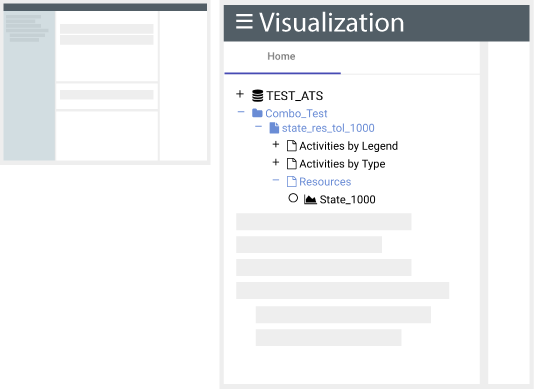

# Source Explorer

*
**Figure 4.** The Source Explorer Panel consists of two main things: a tree that represents the available sources and the pins added by the user. The Home tab is the original sources tree, when the user adds a new pin, it will represent a sub-tree out of the Home tab.
*

The Left Panel of the application contains the Source Explorer. The Source Explorer allows navigation between data sources and selects the sources desired to be visualized in the *Bands Panels*. In addition, the Source Explorer contains pins, which will be explained in detail in the next section.

#### Iconography

There are different icons that represent every node in the Source Explorer tree. These can be expanded, collapsed and/or pinned. Others are graphable sources, which can result in a band that visualizes data.

|                            Icon                             | Name                    | Description                                                  |
| :---------------------------------------------------------: | ----------------------- | ------------------------------------------------------------ |
|               | Database                | A data collection defined in the MPSServer configuration file. |
|                 | Folder                  | These items store and organize uploaded files within a database. |
|             | Files                   | These are the individual files that are uploaded into folders using MPSServer. |
|                   | Grouping                | Source defined organization of graphable objects within uploaded files. |
|             | Graphable Source        | Represents a source that can be rendered on the RAVEN timeline. |
|  | Custom Graphable Source | Represents a graphable source in where the user can pass a filter when requesting for data. |
|                 | Unselected Source       | When a graphable source contains this icon in the left side of its name, means that the source can be graphed. |
|        | Selected Source         | When a graphable source contains this icon in the left side of its name, means that the source can be removed from the source explorer. |
|  | Filter                  | Represents a Sequence Tracker's Metadata Filter. When Sequence Events are selected and the user opens the Details Panel, the data point will have a Metadata Section with the selected filters. |
|    | Filter for Parent Graph | Represent Sequence Tracker sources. When the user adds them, they will all be drawn in the same Band. |

#### How To: Expand/Collapse Nodes

*
**Figure 5. How to: Expand sources in the Source Explorer.** Left side: Click the plus sign (`+`) to see the children of the source of your preference. Right side: Once the source is expanded, all its children will be displayed.
*

 ###### To expand a node:

1. Look for a collapsed Database, Folder or File source in the Source Explorer.
2. Click the plus sign (`+`) icon previous to the source's name. As a result the child sources of the selected one will be expanded.

###### To collapse a node:

1.  Look for a expanded Database, Folder or File icon in the Source Explorer.
2. Click the minus sign (`-`) icon previous to the source's node. As a result the child sources will be collapsed.

#### How To: Select a source

*
**Figure 6. How to: Select a Source in the Source Explorer and add a Band.** Left side: Navigate and click the Radio Button previous to a graphable source of your interest. Right side: The Radio Button will change it's state to selected and a band will be added to the Main Bands Panel.
*

To select a source in the Source Explorer:

1. Browse for a Graphable Source to display.
2. Click the Radio Button () to select the source.

As a result of your selection; a band is added to the *Main Bands Panel* and the Radio Button will change its state to selected ().

#### How To: Add/Delete Folders
A user can add or remove folders from the Source Explorer. These actions need to be performed from the Source Explorer itself or using our server API. To do so,

1. Select a Database or Folder or File. The source will be highlighted and a snowman icon  () will appear.
2. Click the snowman icon ().

##### To add a folder:

3. In the dropdown, select: Add Folder.
4. A dialog will appear, enter the name of the new folder. Please note that
5. Click Add.

##### To delete a folder:

3. In the dropdown, select: Delete.
4. A dialog will appear, confirming the desired action.
5. Click Yes.

## Pins

*
**Figure 7. Pins.**  The (1) Home tab contains the original sources tree. When the user adds a new pin, for example (2) my-pin , it will represent a sub-tree out of the Home tab. To navigate to the content of the pin, click on its name in the Source Explorer's tab.
*

A Pin is a subtree of the sources tree loaded in the Home Tab. It is used when a subtree is of special interest or requires quick and easy access. When a pin is created, a new tab will be added next to the Home tab in the Source Explorer, as shown on the Figure above. If there are bands in the *Bands Panels* that are children of a pinned source, their labels will be attached with the pin name.

#### How To: Pin a Subtree

1. Select a Database, Folder or File. The source will be highlighted and a snowman icon  () will appear.
2. Click the snowman icon ().
3. In the dropdown, select: Add Pin.
4. A dialog will appear, enter the name of the new pin.
5. Click Add.

#### How To: Rename a pin

1. Select an Database, Folder or File that is pinned already. It can be selected from the Home Tab or the Pin's Tab. The source will be highlighted and a snowman icon  () will appear.
2. Click the snowman icon ().
3. In the dropdown, select: Remove Pin
4. A dialog will appear, click: Remove.

<a href="./Raven_101_3_bands.md">Next: Bands</a>

## Filtering the source tree

#### How To: Apply a filter

1. Input a regular expression into the filter panel.
2. Click the "Search" button in the filter panel.
3. The source tree will be pruned: only items whose name matches the regular expression, folders containing those items, and files contained in those items will remain visible.

#### How To: Remove a filter

1. Clear any input in the filter panel.
2. Click the "Search" button in the filter panel.
3. The source tree will display all items, regardless of their names.
