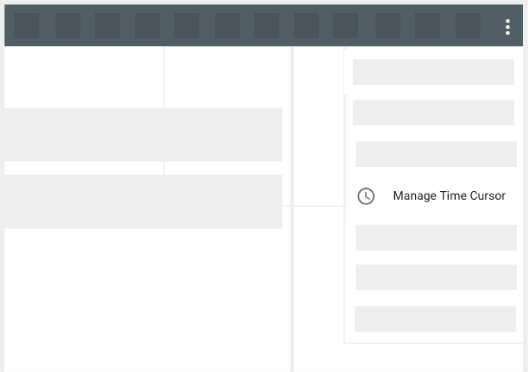

# Time Cursor

The time cursor marks the time passing amongst all the bands in the timeline. It will be represented with a line and move at the defined rate through the timeline.

*
**Figure 18.** Time cursor displayed among all the bands in the main and south Bands panels.
*

#### How to: Add a Time Cursor

1. Add a band. To do so, [select a graphable source in the Source Explorer](./Raven_101_2_source_explorer.md#select-a-source).

2. In the Top Bar, open the Main Menu by clicking the hamburger icon ().

3. In the Dropdown, select the 'Manage Time Cursor' option.

*
**Figure 19.** Where to select the 'Manage Time Cursor' menu option.
*

4. A new drawer is displayed with the Time Cursor options.

5. Toggle 'Show Time Cursor'. By default, if the 'Set Current Cursor Time' is not defined, RAVEN will use the actual current time.

*
**Figure 19: Time cursor added in the application.** Note that in the left side of the application a drawer to Manage Time Cursor is opened. 'Other Options Section' will provide details.
*

### Other options

| Option                  | Description                                                  |
| ----------------------- | ------------------------------------------------------------ |
| Show Time Cursor        | Will toggle the view of the time cursor in the timeline.     |
| Current Cursor Time     | Defines where in the timeline the time cursor is. By default, it will be set to the actual current time. |
| Set Current Cursor Time | Allows the user to manually enter where the time cursor will start. |
| Auto-Page               | If On, as the time cursor reaches the right side of the timeline, the time range will update so the time cursor is always visible. |
| Clock Rate              | Defines the rate at which the cursor moves through the timeline. |
| Current Time Delta      | When the time cursor doesn't have a manual 'Set Current Cursor Time' value defined, the value assigned in this field will be added to the actual current time. |
| Cursor Color            | Defines the color of the cursor. The default color is red.   |
| Cursor Width            | Defines the width of the cursor.                             |

<a href="./Raven_101_5_states_layouts_shareable_links.md">Next: States, Layouts and Shareable Links</a>

